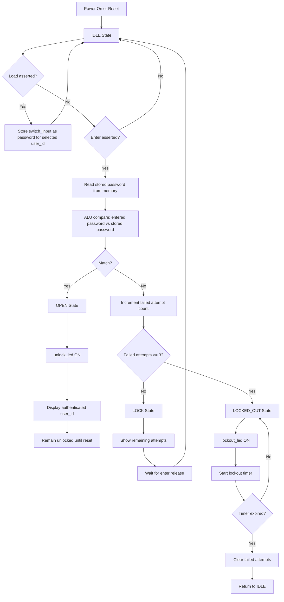

# FPGA Multi-User Password Lock System

A digital system design project that implements a multi-user password lock on FPGA. The design combines password storage, password verification, lockout protection, seven-segment feedback, VGA status visualization, and PS/2 keyboard reception in a single Verilog-based hardware system.

## Overview

This project is built around a `top_module` that coordinates several hardware blocks to create an access-control system for up to 16 users. Each user is identified by a 4-bit `user_id` and has a 4-bit stored password. A user can load a password, enter a candidate password, and receive authentication feedback through LEDs, a seven-segment display, and a VGA dashboard.

The system also includes a brute-force protection mechanism. After three failed attempts, the user is locked out for a timed interval. Repeated lockouts increase the duration of the penalty window.

## Key Features

- Supports 16 user accounts through a 4-bit `user_id`
- Stores a 4-bit password for each user in on-chip register-based memory
- Compares entered and stored passwords through an ALU-based compare path
- Unlocks on a successful match and clears failed-attempt history
- Locks out access after three failed attempts
- Increases the lockout interval on repeated lockout cycles
- Shows status on two LEDs: `unlock_led` and `lockout_led`
- Displays either remaining attempts or authenticated user ID on the seven-segment display
- Generates a 640x480 VGA status interface with themed visual states
- Receives PS/2 keyboard scan data through a dedicated keyboard receiver module
- Includes a simple simulation testbench and Basys 3 style XDC constraints

## Top-Level Interface

The top-level design is implemented in `sources_1/new/top_module.v`.

### Inputs

- `clk`: 100 MHz system clock
- `reset`: asynchronous system reset
- `enter`: triggers password verification
- `load`: stores the current switch value as the selected user's password
- `switch_input[3:0]`: 4-bit password input
- `user_id[3:0]`: active user selection
- `ps2_clk`, `ps2_data`: PS/2 keyboard interface signals

### Outputs

- `unlock_led`: asserted when authentication succeeds
- `lockout_led`: asserted while the system is in timed lockout
- `seven_segment[6:0]`: segment drive for the seven-segment display
- `anode_enable[3:0]`: active-low digit enable signals
- `vga_hsync`, `vga_vsync`: VGA sync outputs
- `vga_red[3:0]`, `vga_green[3:0]`, `vga_blue[3:0]`: VGA color outputs

## System Architecture

The design is partitioned into small functional modules:

- `memory`: stores one 4-bit password for each of 16 users
- `alu` in `alu_compare.v`: performs arithmetic and logical operations; compare mode uses subtraction and checks for zero
- `control_unit`: controls authentication flow, failed-attempt tracking, unlock state, and timed lockout state
- `display_logic`: decides which 4-bit value appears on the seven-segment interface
- `display_mux`: multiplexes the value onto the common-anode four-digit display
- `vga_controller`: generates 640x480 timing and active-pixel coordinates
- `ui_display_logic`: packages authentication state into a compact text/status payload for VGA rendering
- `vga_text_display`: renders the VGA dashboard using a small character ROM and state-based color themes
- `char_rom`: stores bitmap glyphs for digits and status symbols used by the VGA UI
- `ps2_keyboard`: receives PS/2 frames and outputs the latest 8-bit key code with a valid pulse
- `seven_seg_decoder`: standalone decoder module present in the repository, but not used by the current top-level design

## Authentication Flow

1. Select the target user with `user_id[3:0]`.
2. Load a password for that user by setting `switch_input[3:0]` and pulsing `load`.
3. Enter a candidate password on `switch_input[3:0]` and pulse `enter`.
4. The ALU subtracts the stored password from the entered password.
5. If the subtraction result is zero, the control unit transitions to the unlocked state.
6. If the password is incorrect, the failed-attempt counter increments.
7. After three failed attempts, the system enters `LOCKED_OUT` and starts a timed penalty period.

### Authentication Flowchart



## State Behavior

The control unit uses the following states:

- `IDLE`: waiting for an authentication request
- `CHECK`: evaluating the entered password against the stored password
- `OPEN`: authentication successful; unlock output stays asserted until reset
- `LOCK`: incorrect-password feedback state until `enter` is released
- `LOCKED_OUT`: timed denial state after the maximum failed attempts is reached

### Lockout Policy

- Maximum allowed failed attempts: 3
- Base lockout duration: `100000000` clock cycles
- At a 100 MHz input clock, the base lockout is approximately 1 second
- Repeated lockout rounds increase the active lockout duration

## Display Behavior

### Seven-Segment Display

The seven-segment path shows a single hexadecimal digit:

- In `IDLE`, `CHECK`, and `LOCK`, it shows remaining attempts
- In `OPEN`, it shows the authenticated `user_id`
- In `LOCKED_OUT`, it shows `0`

The current `display_mux` scans all four digits but drives the same decoded value while each anode is enabled in sequence.

### LEDs

- `unlock_led` turns on in the `OPEN` state
- `lockout_led` turns on in the `LOCKED_OUT` state

### VGA Output

The VGA interface renders a dashboard-style status display that includes:

- status banner for the current system condition
- user ID tile
- attempts-left tile
- stored password tile
- entered password tile
- comparison marker and ALU result badge
- color theme changes for idle, failed, success, and lockout conditions

## PS/2 Keyboard Support

The project includes a PS/2 receiver in `sources_1/new/ps2_keyboard.v`. It samples keyboard data, reconstructs the received byte, and produces a `key_valid` pulse when a full frame is received.

At the moment, the keyboard receiver is instantiated in the top-level design but its `key_code` output is not yet connected into the authentication input path. In the current implementation, password entry still comes from `switch_input[3:0]`.

## Repository Structure

```text
constrs_1/new/constraints.xdc     FPGA pin constraints
sim_1/new/tb_top_module.v         Simulation testbench
sources_1/new/top_module.v        Top-level integration module
sources_1/new/control_unit.v      Authentication state machine
sources_1/new/memory.v            Password storage for 16 users
sources_1/new/alu_compare.v       ALU and compare logic
sources_1/new/display_logic.v     Seven-segment value selection
sources_1/new/display_mux.v       Seven-segment multiplexing
sources_1/new/vga_controller.v    VGA timing generation
sources_1/new/ui_display_logic.v  VGA status data packaging
sources_1/new/vga_text_display.v  VGA dashboard renderer
sources_1/new/char_rom.v          Character glyph ROM
sources_1/new/ps2_keyboard.v      PS/2 receiver
sources_1/new/seven_seg_decoder.v Unused standalone decoder
utils_1/imports/synth_1/top_module.dcp  Vivado design checkpoint
```

## Target Hardware

The XDC file maps the design to a Digilent Basys 3 style board configuration:

- 100 MHz clock input
- slide switches for password and user selection
- push buttons for `reset`, `enter`, and `load`
- two status LEDs
- four-digit seven-segment display
- VGA output
- PS/2 keyboard connector

Constraint file: `constrs_1/new/constraints.xdc`

## Simulation

A basic testbench is provided in `sim_1/new/tb_top_module.v`.

The supplied test sequence performs the following actions:

1. Resets the design
2. Loads password `1010` for user `0000`
3. Attempts one incorrect password entry (`1111`)
4. Attempts the correct password entry (`1010`)

This is a functional smoke test for the main authentication path. It does not fully exercise repeated lockout rounds, VGA visual validation, or PS/2 keyboard behavior.

## How to Run in Vivado

### Open the Project

1. Open Vivado.
2. Open the project folder or recreate the project and add the files from `sources_1`, `sim_1`, and `constrs_1`.
3. Set `top_module` as the top module.
4. Set `tb_top_module` as the simulation top when running simulation.

### Run Simulation

1. Launch simulation.
2. Observe `unlock_led`, `lockout_led`, `seven_segment`, and the internal state transitions.
3. Verify that a wrong password increments the failed-attempt path and that a correct password enters the `OPEN` state.

### Synthesize and Program

1. Run synthesis.
2. Run implementation.
3. Generate a bitstream.
4. Program the FPGA.
5. Use the switches and buttons to interact with the lock system on hardware.

## Design Notes

- Password memory is volatile register storage; values are not retained across power cycles or configuration resets.
- Password width is currently limited to 4 bits, making the project appropriate for digital design demonstration rather than secure deployment.
- The `OPEN` state is persistent and remains active until reset.
- The VGA UI exposes internal values such as stored and entered passwords, which is helpful for debugging but not suitable for a production security system.
- The repository includes both `display_mux.v` and `seven_seg_decoder.v`; the active top-level path uses `display_mux.v` directly.

## Possible Future Improvements

- Connect PS/2 key input directly to password entry logic
- Increase password width and support multi-digit entry
- Add non-volatile password storage or initialization defaults
- Mask sensitive values on the VGA interface in normal operation
- Add more complete simulation coverage for lockout timing and keyboard input
- Display labels or multi-character messages on the seven-segment display

## License

No license file is currently included in the repository. Add a project license if you plan to publish or distribute this work.
